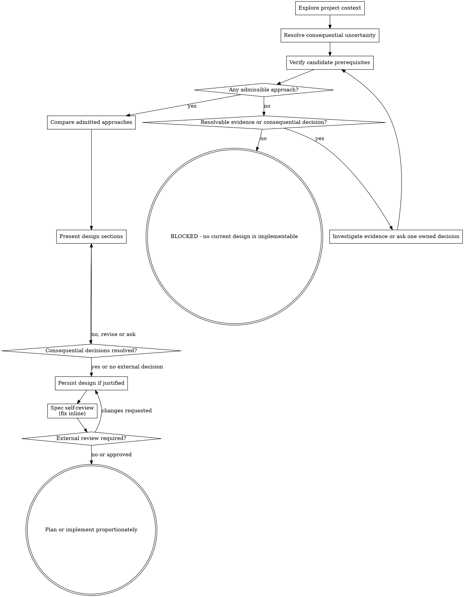

# Brainstorming Ideas Into Designs

> **Codex 5.6 adaptation:** The frontmatter description is the scope gate. Apply this upstream method only after that gate matches; resolve ordinary engineering choices autonomously and scale artifacts and checkpoints to the uncertainty, risk, and handoff need.

Help turn ideas into fully formed designs and specs through natural collaborative dialogue.

Start by understanding the current project context, then resolve the consequential questions needed to refine the idea. Once you understand what you are building, present a proportionate design.

<HARD-GATE>
Do NOT invoke an implementation skill, write code, scaffold, or take implementation action until a coherent design is established and consequential product or authority decisions are resolved. Governing user and repository instructions determine when approval is required; do not invent approval gates for ordinary reversible engineering choices.
</HARD-GATE>

## Anti-Pattern: "This Is Too Simple To Need A Design"

Every task that substantively matches the trigger goes through this process. Do not evade design work by relabeling a genuinely ambiguous or high-impact change as simple. Clear local changes do not match this skill and should proceed directly with bounded inspection and focused verification.

## Checklist

Create a task for each applicable item and complete them in order:

1. **Explore project context** — check files, docs, recent commits
2. **Offer the visual companion just-in-time** — NOT upfront. The first time a question would genuinely be clearer shown than described, offer it then (its own message); on approval its browser tab opens for you. If no visual question ever arises, never offer it. See the Visual Companion section below.
3. **Resolve consequential uncertainty** — investigate first; ask one question at a time only when missing intent or authority would materially change the result
4. **Admit approaches** — verify each candidate's load-bearing prerequisites for the exact target scope, reject false or conflicting candidates, and keep unknown prerequisites conditional
5. **Compare approaches** — propose 2-3 materially different admitted approaches with trade-offs and a recommendation; if only one is credible, explain why
6. **Present design** — in sections scaled to their complexity; request decisions only where the user owns a consequential choice
7. **Write a design doc when durable handoff value justifies it** — use the governing location and commit policy; otherwise keep the design in the current task
8. **Design/spec self-review** — quick inline check for prerequisites, placeholders, contradictions, ambiguity, and scope (see below)
9. **Obtain external review only when required** — for an explicit product decision, approval boundary, or requested checkpoint
10. **Transition proportionately** — invoke the psilon writing-plans skill only if its trigger matches; otherwise implement directly

## Process Flow

**The terminal state is either a resolved admissible design or an explicit
block with the evidence needed to clear it.** Invoke
`superpowers-writing-plans-psilon` next only when a design exists and its
durable-plan trigger matches. Otherwise proceed with direct implementation, the
applicable domain skill, or the blocked report.

## The Process

**Understanding the idea:**

- Check out the current project state first (files, docs, recent commits)
- Before asking detailed questions, assess scope: if the request describes multiple independent subsystems (e.g., "build a platform with chat, file storage, billing, and analytics"), flag this immediately. Don't spend questions refining details of a project that needs to be decomposed first.
- If the project is too large for a single spec, help the user decompose into sub-projects: what are the independent pieces, how do they relate, what order should they be built? Then brainstorm the first sub-project through the normal design flow. Each sub-project gets its own spec → plan → implementation cycle.
- For appropriately scoped projects, investigate and infer ordinary engineering details before asking
- Ask only when consequential intent, authority, or an external contract cannot be resolved from available evidence
- When a question is needed, ask one at a time; prefer concise choices when they genuinely clarify the decision
- Focus on understanding: purpose, constraints, success criteria

**Exploring approaches:**

- For each candidate, identify every load-bearing prerequisite. Verify each one against current authoritative evidence for the exact target scope, and search for evidence that disproves it.
- Reject a candidate when a prerequisite is false or conflicts with a requirement, contract, or authority boundary. If a load-bearing prerequisite remains unknown, keep the candidate conditional and do not recommend it as the current design.
- When no candidate is currently admissible, lead with `BLOCKED — no current
  design is implementable` and name the evidence needed to clear the gate. A
  possible future mechanism may appear only as a clearly labeled conditional
  option. Do not call it the recommended design or transition it to planning.
- Treat implementation support, a working example, or an available integration as evidence of capability only. It does not prove target coverage, data availability, compatibility, or applicability.
- Compare 2-3 materially different admitted approaches with trade-offs; if only one is credible, state why. Keep rejected candidates internal unless the user asks for them or the rejection materially explains the recommendation.
- Present options conversationally with your recommendation and reasoning
- Lead with your recommended option and explain why
- YAGNI ruthlessly - remove unnecessary features from every approach and design

**Presenting the design:**

- Once you believe you understand what you're building, present the design
- Scale each section to its complexity: a few sentences if straightforward, up to 200-300 words if nuanced
- Ask after a section only when it contains a consequential user-owned choice; otherwise self-check and continue
- Cover: architecture, components, data flow, error handling, testing
- Be ready to go back and clarify if something doesn't make sense

**Design for isolation and clarity:**

- Break the system into smaller units that each have one clear purpose, communicate through well-defined interfaces, and can be understood and tested independently
- For each unit, you should be able to answer: what does it do, how do you use it, and what does it depend on?
- Can someone understand what a unit does without reading its internals? Can you change the internals without breaking consumers? If not, the boundaries need work.
- Smaller, well-bounded units are also easier for you to work with - you reason better about code you can hold in context at once, and your edits are more reliable when files are focused. When a file grows large, that's often a signal that it's doing too much.

**Working in existing codebases:**

- Explore the current structure before proposing changes. Follow existing patterns.
- Where existing code has problems that affect the work (e.g., a file that's grown too large, unclear boundaries, tangled responsibilities), include targeted improvements as part of the design - the way a good developer improves code they're working in.
- Don't propose unrelated refactoring. Stay focused on what serves the current goal.

## After the Design

**Documentation:**

- Write a durable design spec only when complexity, cross-session handoff, an approval boundary, or repository policy gives it continuing value
- Use the user- or repository-selected location; absent one, `docs/superpowers/specs/YYYY-MM-DD-<topic>-design.md` remains the upstream default
- Use elements-of-style:writing-clearly-and-concisely skill if available
- Commit the design document only when the task and governing git policy authorize that commit

**Spec Self-Review:**
After establishing the design, and after writing the spec when one is justified, look at it with fresh eyes:

1. **Applicability check:** Does every recommended approach have current authoritative support for each load-bearing prerequisite in the exact target scope? Did you search for disconfirming evidence? Reject false candidates; label unknown candidates conditional and exclude them from the current recommendation.
2. **Placeholder scan:** Any "TBD", "TODO", incomplete sections, or vague requirements? Fix them.
3. **Internal consistency:** Do any sections contradict each other? Does the architecture match the feature descriptions?
4. **Scope check:** Is this focused enough for a single implementation plan, or does it need decomposition?
5. **Ambiguity check:** Could any requirement be interpreted two different ways? If so, pick one and make it explicit.

Fix any issues inline. No need to re-review — just fix and move on.

**External Review Gate:**
After self-review, request user review only when the spec freezes a consequential product decision, crosses an approval boundary, or the user requested a checkpoint. Otherwise proceed autonomously. If review is required and changes are requested, revise the spec and re-run the self-review.

**Implementation:**

- Invoke `superpowers-writing-plans-psilon` only when its trigger conditions match
- Otherwise proceed directly with the relevant implementation workflow

## Visual Companion

A browser-based companion for showing mockups, diagrams, and visual options during brainstorming. Available as a tool — not a mode. Accepting the companion means it's available for questions that benefit from visual treatment; it does NOT mean every question goes through the browser.

**Offering the companion (just-in-time):** Do NOT offer it upfront. Wait until a question would genuinely be clearer shown than told — a real mockup / layout / diagram question, not merely a UI *topic*. The first time that happens, offer it then, as its own message:
> "This next part might be easier if I show you — I can put together mockups, diagrams, and comparisons in a browser tab as we go. It's still new and can be token-intensive. Want me to? I'll open it for you."

**This offer MUST be its own message.** Only the offer — no clarifying question, summary, or other content. Wait for the user's response. If they accept, start the server with `--open` so their browser opens to the first screen automatically. If they decline, continue text-only and don't offer again unless they raise it.

**Per-question decision:** Even after the user accepts, decide FOR EACH QUESTION whether to use the browser or the terminal. The test: **would the user understand this better by seeing it than reading it?**

- **Use the browser** for content that IS visual — mockups, wireframes, layout comparisons, architecture diagrams, side-by-side visual designs
- **Use the terminal** for content that is text — requirements questions, conceptual choices, tradeoff lists, A/B/C/D text options, scope decisions

A question about a UI topic is not automatically a visual question. "What does personality mean in this context?" is a conceptual question — use the terminal. "Which wizard layout works better?" is a visual question — use the browser.

If they agree to the companion, read the detailed guide before proceeding:
`visual-companion.md`
