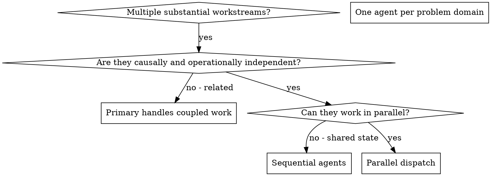

# Dispatching Parallel Agents

> **Codex 5.6 adaptation:** The frontmatter description is the scope gate. Use fresh or minimally forked agent context where available, assign exclusive mutable scopes, and keep integration and final verification with the primary agent.

## Overview

You delegate tasks to specialized agents with isolated context. By precisely crafting their instructions and context, you ensure they stay focused and succeed at their task. They should receive only the task-local context they need. In Codex, prefer `fork_turns: "none"` or the smallest useful recent-turn fork when constructing an isolated task; retain full-history inheritance only when the work genuinely depends on it. This also preserves your own context for coordination work.

When you have multiple substantial independent deliverables or unrelated
failures, doing them sequentially wastes wall time. Each verified independent
workstream can proceed in parallel.

**Core principle:** Dispatch one agent per independent problem domain. Let them work concurrently.

## When to Use



**Use when:**
- 2+ substantial deliverables or problem domains with verified causal, input, and ownership independence
- For failures, evidence supports distinct causes or failure domains
- For implementation or research, each deliverable has its own acceptance and no result dependency
- Each problem can be understood without context from others
- No overlapping mutable state between workstreams
- The wall-time reduction materially exceeds dispatch and integration overhead

**Don't use when:**
- Tasks are inside one accepted implementation plan governed by `superpowers-subagent-driven-development-psilon`
- Failures are related (fix one might fix others)
- Need to understand full system state
- Agents would interfere with each other

## The Pattern

### 1. Identify Independent Domains

Group work by distinct deliverable. For failures, group by what is broken:
- File A tests: Tool approval flow
- File B tests: Batch completion behavior
- File C tests: Abort functionality

Before dispatching, establish that each domain has a distinct deliverable,
exclusive mutable scope, the required inputs and tool access, and no
load-bearing dependency on another domain's result. Search for shared causes,
contracts, generated artifacts, runtime resources, and assumptions. Different
files or symptoms do not prove independence. If any load-bearing prerequisite
or shared cause remains unknown, keep the bounded scoping work with the primary
until it is resolved.

### 2. Create Focused Agent Tasks

Each agent gets:
- **Specific scope:** One subsystem or distinct deliverable, with exclusive mutable ownership when editing
- **Exact target:** The users, data, environment, contract, or artifact the conclusion must cover
- **Verified inputs:** Current authoritative sources and established prerequisites; label unresolved facts instead of supplying an expected conclusion
- **Clear outcome:** The implementation, research finding, or failure resolution to deliver, with its acceptance boundary
- **Constraints:** Exact mutable scope, read-only scope, dependencies, and forbidden side effects
- **Expected output:** The artifact or concise evidence report the primary will integrate

### 3. Dispatch in Parallel

Issue all three subagent dispatches in the same response — they run in parallel:

```text
Subagent (general-purpose): "Fix agent-tool-abort.test.ts failures"
Subagent (general-purpose): "Fix batch-completion-behavior.test.ts failures"
Subagent (general-purpose): "Fix tool-approval-race-conditions.test.ts failures"
# All three run concurrently.
```

Multiple dispatch calls in one response = parallel execution. One per response = sequential.

### 4. Review and Integrate

When agents return:
- Read each summary
- Verify fixes don't conflict
- Integrate all changes
- Run one outcome-proportionate verification pass after the last relevant integration change

## Agent Prompt Structure

Good agent prompts are:
1. **Focused** - One clear problem domain
2. **Self-contained** - All context needed to understand the problem
3. **Specific about output** - What should the agent return?

```markdown
Fix the 3 failing tests in src/agents/agent-tool-abort.test.ts:

1. "should abort tool with partial output capture" - expects 'interrupted at' in message
2. "should handle mixed completed and aborted tools" - fast tool aborted instead of completed
3. "should properly track pendingToolCount" - expects 3 results but gets 0

These are observed failures; their root cause is not established. Your task:

1. Read the test file and understand what each test verifies
2. Establish the root cause from current evidence
3. Make the smallest correction supported by that cause; do not change
   behavior or expectations without proving which contract is wrong

Return: Summary of what you found and what you fixed.
```

## Common Mistakes

**❌ Too broad:** "Fix all the tests" - agent gets lost
**✅ Specific:** "Fix agent-tool-abort.test.ts" - focused scope

**❌ No context:** "Fix the race condition" - agent doesn't know where
**✅ Context:** Paste the error messages and test names

**❌ No constraints:** Agent might refactor everything
**✅ Constraints:** "Do NOT change production code" or "Fix tests only"

**❌ Vague output:** "Fix it" - you don't know what changed
**✅ Specific:** "Return summary of root cause and changes"

## When NOT to Use

**Related failures:** Fixing one might fix others - investigate together first
**Need full context:** Understanding requires seeing entire system
**Exploratory debugging:** You don't know what's broken yet
**Shared state:** Agents would interfere (editing same files, using same resources)

## Real Example from Session

**Scenario:** 6 test failures across 3 files after major refactoring

**Failures:**
- agent-tool-abort.test.ts: 3 abort/completion assertion failures
- batch-completion-behavior.test.ts: 2 failures (tools not executing)
- tool-approval-race-conditions.test.ts: 1 failure (execution count = 0)

**Independence gate:** Inspect the failing call paths, fixtures, shared setup,
and mutable files. Use the dispatch below only if that bounded check establishes
distinct causes or ownership and no load-bearing dependency between domains.

**Dispatch:**
```
Agent 1 → Fix agent-tool-abort.test.ts
Agent 2 → Fix batch-completion-behavior.test.ts
Agent 3 → Fix tool-approval-race-conditions.test.ts
```

**Results:**
- Agent 1: Replaced timeouts with event-based waiting
- Agent 2: Fixed event structure bug (threadId in wrong place)
- Agent 3: Added wait for async tool execution to complete

**Integration:** All fixes independent, no conflicts, full suite green

## Verification

After agents return:
1. **Review each summary** - Understand what changed
2. **Check for conflicts** - Did agents edit the same code or invalidate shared assumptions?
3. **Verify the integrated outcome** - Run the focused or full checks required by the claim's scope
4. **Spot check** - Agents can make systematic errors
