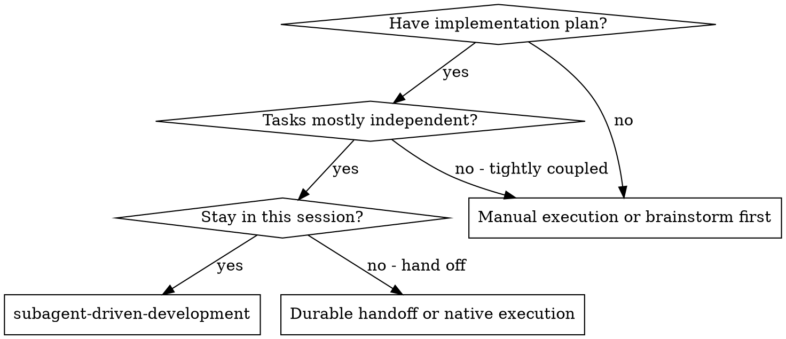

# Subagent-Driven Development

> **Codex 5.6 adaptation:** The frontmatter description is the scope gate. Preserve the upstream execution, recovery, and review machinery for qualifying large plans, while following higher-priority user and repository policy for workspace isolation, branches, commits, tests, model overrides, and final integration.

Execute plan by dispatching a fresh implementer subagent per task, a task review
(target applicability + spec compliance + code quality) after each, and a broad
whole-branch review at the end.

**Why subagents:** You delegate tasks to specialized agents with isolated context. By precisely crafting their instructions and context, you ensure they stay focused and succeed at their task. In Codex, prefer `fork_turns: "none"` or the smallest useful recent-turn fork, and construct exactly the task-local context they need. This also preserves your own context for coordination work.

**Core principle:** Fresh subagent per task + task review (applicability + spec + quality) + broad final review = high quality, fast iteration

**Narration:** between tool calls, narrate at most one short line — the
ledger and the tool results carry the record.

**Continuous execution:** Do not pause to check in with your human partner between tasks. Execute all tasks from the plan without stopping. The only reasons to stop are: BLOCKED status you cannot resolve, ambiguity that genuinely prevents progress, or all tasks complete. "Should I continue?" prompts and progress summaries waste their time — they asked you to execute the plan, so execute it.

## When to Use

**vs. durable handoff or native execution:**
- Same session (no context switch)
- Fresh subagent per task (no context pollution)
- Review after each task (target applicability + spec compliance + code quality), broad review at the end
- Faster iteration (no human-in-loop between tasks)

This skill owns task execution inside its accepted plan. Do not also invoke
`superpowers-dispatching-parallel-agents-psilon` for those tasks; use parallel
dispatch only for separate external workstreams outside this controller.

## The Process

```dot
digraph process {
    rankdir=TB;

    subgraph cluster_per_task {
        label="Per Task";
        "Dispatch implementer subagent (./implementer-prompt.md)" [shape=box];
        "Implementer asks questions?" [shape=diamond];
        "Answer questions, provide context" [shape=box];
        "Implementer implements, verifies, records change, self-reviews" [shape=box];
        "Generate review package, dispatch task reviewer (./task-reviewer-prompt.md)" [shape=box];
        "Applicability ✅, spec ✅, and quality approved?" [shape=diamond];
        "Applicability false or blocked?" [shape=diamond];
        "Resolve evidence; reject or redesign inadmissible mechanism" [shape=box];
        "Admissible route established?" [shape=diamond];
        "Code change required?" [shape=diamond];
        "Finding conflicts with plan text?" [shape=diamond];
        "Resolve from authoritative sources" [shape=box];
        "Consequential choice unresolved?" [shape=diamond];
        "Ask human partner which governs" [shape=box];
        "Fix round R of 5: R≤3 resume implementer; R≥4 fresh implementer, more capable model" [shape=box];
        "Dispatch scoped re-review (./re-review-prompt.md)" [shape=box];
        "All findings addressed?" [shape=diamond];
        "R = 5?" [shape=diamond];
        "Adjudicate each open finding" [shape=box];
        "Any load-bearing finding?" [shape=diamond];
        "STOP: report BLOCKED to human partner" [shape=box];
        "Park findings in ledger with rulings" [shape=box];
        "Append completion to ledger, mark todo complete" [shape=box];
    }

    "Setup: governing workspace policy, ledger check, read plan, pre-flight review" [shape=box];
    "More tasks remain?" [shape=diamond];
    "Dispatch final code reviewer (../superpowers-requesting-code-review-psilon/code-reviewer.md)" [shape=box];
    "Final findings? ONE fix dispatch, one scoped re-review, adjudicate residuals" [shape=box];
    "Final review clean: delete this plan's workspace" [shape=box];
    "Follow governing integration and handoff policy" [shape=box style=filled fillcolor=lightgreen];

    "Setup: governing workspace policy, ledger check, read plan, pre-flight review" -> "Dispatch implementer subagent (./implementer-prompt.md)";
    "Dispatch implementer subagent (./implementer-prompt.md)" -> "Implementer asks questions?";
    "Implementer asks questions?" -> "Answer questions, provide context" [label="yes"];
    "Answer questions, provide context" -> "Implementer implements, verifies, records change, self-reviews";
    "Implementer asks questions?" -> "Implementer implements, verifies, records change, self-reviews" [label="no"];
    "Implementer implements, verifies, records change, self-reviews" -> "Generate review package, dispatch task reviewer (./task-reviewer-prompt.md)";
    "Generate review package, dispatch task reviewer (./task-reviewer-prompt.md)" -> "Applicability ✅, spec ✅, and quality approved?";
    "Applicability ✅, spec ✅, and quality approved?" -> "Append completion to ledger, mark todo complete" [label="yes"];
    "Applicability ✅, spec ✅, and quality approved?" -> "Applicability false or blocked?" [label="no"];
    "Applicability false or blocked?" -> "Resolve evidence; reject or redesign inadmissible mechanism" [label="yes"];
    "Resolve evidence; reject or redesign inadmissible mechanism" -> "Admissible route established?";
    "Admissible route established?" -> "Code change required?" [label="yes"];
    "Code change required?" -> "Fix round R of 5: R≤3 resume implementer; R≥4 fresh implementer, more capable model" [label="yes"];
    "Code change required?" -> "Generate review package, dispatch task reviewer (./task-reviewer-prompt.md)" [label="no - evidence changed"];
    "Admissible route established?" -> "STOP: report BLOCKED to human partner" [label="no"];
    "Applicability false or blocked?" -> "Finding conflicts with plan text?" [label="no"];
    "Finding conflicts with plan text?" -> "Resolve from authoritative sources" [label="yes"];
    "Resolve from authoritative sources" -> "Consequential choice unresolved?";
    "Consequential choice unresolved?" -> "Ask human partner which governs" [label="yes"];
    "Consequential choice unresolved?" -> "Fix round R of 5: R≤3 resume implementer; R≥4 fresh implementer, more capable model" [label="no"];
    "Ask human partner which governs" -> "Fix round R of 5: R≤3 resume implementer; R≥4 fresh implementer, more capable model";
    "Finding conflicts with plan text?" -> "Fix round R of 5: R≤3 resume implementer; R≥4 fresh implementer, more capable model" [label="no"];
    "Fix round R of 5: R≤3 resume implementer; R≥4 fresh implementer, more capable model" -> "Dispatch scoped re-review (./re-review-prompt.md)";
    "Dispatch scoped re-review (./re-review-prompt.md)" -> "All findings addressed?";
    "All findings addressed?" -> "Append completion to ledger, mark todo complete" [label="yes"];
    "All findings addressed?" -> "R = 5?" [label="no"];
    "R = 5?" -> "Fix round R of 5: R≤3 resume implementer; R≥4 fresh implementer, more capable model" [label="no - next round"];
    "R = 5?" -> "Adjudicate each open finding" [label="yes - breaker trips"];
    "Adjudicate each open finding" -> "Any load-bearing finding?";
    "Any load-bearing finding?" -> "STOP: report BLOCKED to human partner" [label="yes"];
    "Any load-bearing finding?" -> "Park findings in ledger with rulings" [label="no"];
    "Park findings in ledger with rulings" -> "Append completion to ledger, mark todo complete";
    "Append completion to ledger, mark todo complete" -> "More tasks remain?";
    "More tasks remain?" -> "Dispatch implementer subagent (./implementer-prompt.md)" [label="yes"];
    "More tasks remain?" -> "Dispatch final code reviewer (../superpowers-requesting-code-review-psilon/code-reviewer.md)" [label="no"];
    "Dispatch final code reviewer (../superpowers-requesting-code-review-psilon/code-reviewer.md)" -> "Final findings? ONE fix dispatch, one scoped re-review, adjudicate residuals";
    "Final findings? ONE fix dispatch, one scoped re-review, adjudicate residuals" -> "Final review clean: delete this plan's workspace";
    "Final review clean: delete this plan's workspace" -> "Follow governing integration and handoff policy";
}
```

## Setup

Follow the governing repository and user workspace policy. Use an isolated worktree only when that policy permits or requires it; never create or access one where it is prohibited. Work on the current branch when governing policy authorizes it, including main/master. Record the exact working directory and starting revision before dispatching.

Conversation memory does not survive compaction. In real sessions,
controllers that lost their place have re-dispatched entire completed task
sequences — the single most expensive failure observed. Track progress in
a ledger file, not only in todos.

- Each plan owns a workspace: at skill start, run this skill's
  `scripts/sdd-workspace PLAN_FILE` — it prints the plan's git-ignored
  directory (`<repo-root>/.superpowers/sdd/<plan-basename>-<path-hash>/`), home
  to every artifact for THIS canonical plan path: ledger, briefs, reports,
  review packages. The helper writes that resolved identity to `<workspace>/plan-path`; use it instead of the caller's relative, absolute, or symlink spelling.
  Another plan's directory is never yours to read or write.
- Check for this plan's ledger at `<workspace>/progress.md`. If its first
  line names the exact canonical path in `<workspace>/plan-path`, tasks with a `Task <N>: complete` line are DONE
  — do not re-dispatch them; resume at the first task without one. A task
  whose last line is a fix round is mid-loop: resume the loop at the next
  round. A ledger whose first line names a different plan file — or a stray
  ledger at the old flat path `.superpowers/sdd/progress.md` — is another
  plan's progress: leave it in place and start your own, fresh.
- Create the ledger with its identity as the first line:
  `# SDD ledger — plan: <canonical path copied from workspace/plan-path>`.
- The ledger is your recovery map. In commit mode, verify its boundaries with `git log`. In snapshot mode, its tree IDs are unreferenced session-scoped objects: verify each with `git cat-file -e '<tree>^{tree}'` before reuse and never call them durable history.
- `git clean -fdx` destroys the ignored workspace. Commit mode can recover from `git log`. Snapshot mode cannot reliably recover its ledger and prior boundaries; stop rather than reconstructing progress from memory.

Read the plan once, note its context, target scope, authoritative references,
Global Constraints, and task statuses, and create a todo per task.

Before dispatching Task 1, scan the plan once for conflicts:

- tasks that contradict each other or the plan's Global Constraints
- anything the plan explicitly mandates that the review rubric treats as a
  defect (a test that asserts nothing, verbatim duplication of a logic block)

An accepted plan records intent and decisions; acceptance does not prove its
factual assumptions. During preflight, identify each Ready task's load-bearing
prerequisites, verify them against current authoritative evidence for the exact
target scope, and search for disconfirming evidence. Before a later dispatch,
reuse still-current evidence and recheck only prerequisites affected by earlier
work or material drift. A supported API, working example, or prior task proves
capability only, not target coverage or applicability. Do not dispatch a task
when a prerequisite is false. Treat an unknown load-bearing prerequisite, or a
`Discovery` or `Provisional` task whose gate is still open, as not ready:
resolve its evidence gate and update the plan before resuming this workflow.

Before Task 1, require a clean working tree in both modes, without cleaning, stashing, or restoring user work. If it is dirty, do not use SDD. Record the plan-wide `MERGE_BASE` in the ledger: `git rev-parse HEAD` in commit mode or `git rev-parse HEAD^{tree}` in snapshot mode. Record the mode and boundary separately from each task's BASE; final review uses this value. In both modes, create one cumulative plan-scope file in the plan workspace and add each task's exact, non-overlapping mutable paths before its first dispatch.

Snapshot mode may start later tasks with uncommitted changes only when every changed path belongs to the cumulative plan scope; any other dirty path stops this workflow.

Resolve conflicts from authoritative requirements, repository policy, and available evidence when one clearly governs. Ask the human partner one batched question only when a consequential requirement or authority choice remains genuinely unresolved; do not interrupt for ordinary engineering decisions. If the scan is clean, proceed without comment. The review loop remains the net for conflicts that only emerge from implementation.

## Model Selection

Use the least costly available model configuration that can handle each role without increasing retries, but follow the Codex runtime's model policy and available options.

**Mechanical implementation tasks** (isolated functions, clear specs, 1-2 files): use a fast, cheap model. Most implementation tasks are mechanical when the plan is well-specified.

**Integration and judgment tasks** (multi-file coordination, pattern matching, debugging): use a standard model.

**Architecture and design tasks**: use the most capable available model.
The final whole-branch review is one of these — dispatch it on the most
capable available model, not the session default.

**Review tasks**: choose the model with the same judgment, scaled to the
diff's size, complexity, and risk. A small mechanical diff does not need the
most capable model; a subtle concurrency change does. Scoped re-reviews of
small fix diffs take a cheap-to-mid tier.

**Fix-loop escalation (rounds 4-5)**: use a model at least one tier above
the implementer that got stuck.

**In Codex, inherit the parent model and reasoning effort by default.** Override them only when the user, governing policy, or a concrete role-specific need justifies a supported alternative. An unsupported tier name or automatic downgrade creates more risk than it saves.

**Turn count beats token price.** Wall-clock and context cost scale with how
many turns a subagent takes, and the cheapest models routinely take 2-3× the
turns on multi-step work — costing more overall. Use a mid-tier model as the
floor for reviewers and for implementers working from prose descriptions.
When the task's plan text contains the complete code to write, the
implementation is transcription plus focused verification: use the cheapest tier for
that implementer. Single-file mechanical fixes also take the cheapest tier.

**Task complexity signals (implementation tasks):**
- Touches 1-2 files with a complete spec → cheap model
- Touches multiple files with integration concerns → standard model
- Requires design judgment or broad codebase understanding → most capable model

## The Task Loop

Everything you paste into a dispatch prompt — and everything a subagent
prints back — stays resident in your context for the rest of the session
and is re-read on every later turn. Hand artifacts over as files.

### 1. Dispatch the implementer

Add the new task's exact exclusive paths to the cumulative plan-scope file and inspect status for those literal paths. They must be clean before dispatch, so prior user work cannot enter the task boundary. Record a stable BASE for the review package and fix rounds.

In commit mode, require the whole working tree to be clean before dispatch and set BASE to `git rev-parse HEAD`. After every authorized task or fix commit, require the whole tree to be clean and the BASE..HEAD changed-path set to stay inside that task's mutable scope before recording HEAD or starting review.

In snapshot mode, Task 1 BASE is `MERGE_BASE`; each later BASE is the prior task's cumulative HEAD snapshot. Run
`scripts/worktree-snapshot PLAN_FILE CUMULATIVE_PATHS_FILE MERGE_BASE` after the task and
record its tree ID as HEAD. The script seeds a temporary index from repository
`MERGE_BASE` and refuses to run if live `HEAD^{tree}` has changed, then overlays
only the named paths. The cumulative file must include all prior plan-owned
paths as well as the current task's paths. It rejects broad or non-literal paths
and any nested repository or gitlink whose working state the parent tree cannot
represent. It changes no ref, HEAD, or real index. Before and after each
dispatch, inspect working-tree status and stop if any changed path falls outside
the cumulative scope. Use the same cumulative file for fix-round snapshots.

- **Task brief:** before dispatching an implementer, run this skill's
  `scripts/task-brief PLAN_FILE N` — it extracts the task's full text to a
  uniquely named file and prints the path. Compose the dispatch so the
  brief stays the single source of task requirements. Your dispatch should
  contain: (1) one line on where this task fits in the project; (2) the exact
  target scope and authoritative references used by preflight; (3) the brief
  path, introduced as "read this first — it contains the required outcome and
  binding constraints"; (4) verified interfaces and decisions from earlier
  tasks that the brief cannot know; (5) your evidence-backed resolution of any
  ambiguity you noticed in the brief; (6) the report-file path and report
  contract. Exact contractual values (numbers, strings, signatures, test cases)
  appear only in the brief. Do not call a provisional or unverified value
  exact. Never make a subagent read the whole plan file.
- **Report file:** name the implementer's report file after the brief
  (brief `…/task-N-brief.md` → report `…/task-N-report.md`) and put it in
  the dispatch prompt. The implementer writes the full report there and
  returns only status, commits, a one-line verification summary, and concerns.
- A dispatch prompt describes one task, not the session's history. Do not
  paste accumulated prior-task summaries ("state after Tasks 1-3") into
  later dispatches — a real session's dispatch hit 42k chars of which 99%
  was pasted history. A fresh subagent needs its task, the interfaces it
  touches, and the global constraints. Nothing else.
- If an earlier task parked a finding in the area this task touches, carry
  a pointer to that ledger entry in the dispatch.
- Record the implementer's agent identity from the dispatch result —
  fix-loop rounds 1-3 resume this agent.
- Never dispatch multiple implementation subagents in parallel (conflicts).

Template: [implementer-prompt.md](implementer-prompt.md)

### 2. Handle the report

Implementer subagents report one of four statuses. Handle each appropriately:

**DONE:** Record the task's HEAD boundary, then generate the review package
(`scripts/review-package PLAN_FILE BASE HEAD`, from this skill's directory — it
prints the unique file path it wrote). BASE is the commit or snapshot recorded
before dispatch; never substitute `HEAD~1`, which silently drops earlier task
commits. Then dispatch the task reviewer with the printed path.

**DONE_WITH_CONCERNS:** The implementer completed the work but flagged doubts. Read the concerns before proceeding. If the concerns are about correctness or scope, address them before review. If they're observations (e.g., "this file is getting large"), note them and proceed to review.

**NEEDS_CONTEXT:** The implementer needs information that wasn't provided. Provide the missing context and re-dispatch.

**BLOCKED:** The implementer cannot complete the task. Assess the blocker:
1. If it's a context problem, provide more context and re-dispatch with the same model
2. If the task requires more reasoning, re-dispatch with a more capable model
3. If the task is too large, break it into smaller pieces
4. If the plan itself is wrong, resolve it from authoritative requirements or escalate only a consequential unresolved choice to the human

**Never** ignore an escalation or force the same model to retry without changes. If the implementer said it's stuck, something needs to change.

If the implementer asks questions — before starting or mid-task — answer
clearly and completely, provide additional context if needed, and don't
rush it into implementation.

### 3. Review the task

Per-task reviews are task-scoped gates. The broad review happens once, at the
final whole-branch review. Never skip the task review, and never accept a
report missing any verdict — target applicability, spec compliance, and task
quality are all required. Implementer self-review never replaces the task
review; both are needed.

- Hand the reviewer its diff as a file: run this skill's
  `scripts/review-package PLAN_FILE BASE HEAD` and pass the reviewer the file path
  it prints (or, without bash: `git diff --stat` and `git diff -U10` for the
  range, redirected to one uniquely named
  file). The output never enters your own context, and the reviewer sees
  the stat summary, full diff with context, and objective commit IDs in one Read
  call. Use the stable BASE and HEAD commit or snapshot boundaries recorded for
  this task — never `HEAD~1`, which silently truncates multi-commit tasks. Never
  dispatch a task reviewer without a diff file.
- **Reviewer inputs:** the task reviewer gets three paths — the same brief
  file, the report file, and the review package — plus the global
  constraints that bind the task, the exact target scope, and the authoritative
  references that can establish or disprove its prerequisites.
- The global-constraints block you hand the reviewer is its attention
  lens. Copy only binding requirements from the authoritative contract or
  approved specification: exact values, exact formats, and stated relationships
  between components ("same layout as X", "matches Y"). A plan's factual
  assumption or proposed mechanism is not a binding constraint merely because
  it appears under Global Constraints. The reviewer's template already carries
  the process rules (YAGNI, test hygiene, review method) — the constraints block
  is for what THIS project's authoritative requirements demand.
- Do not add open-ended directives like "check all uses" or "run race tests
  if useful" without a concrete, task-specific reason
- Do not ask a reviewer to re-run tests the implementer already ran on the
  same code — the implementer's report carries the execution evidence
- Do not pre-judge findings for the reviewer — never instruct a reviewer to
  ignore or not flag a specific issue. If you believe a finding would be a
  false positive, let the reviewer raise it and adjudicate it in the review
  loop. If the prompt you are writing contains "do not flag," "don't treat X
  as a defect," "at most Minor," or "the plan chose" — stop: you are
  pre-judging, usually to spare yourself a review loop.
The task reviewer may report "⚠️ Cannot verify from diff" items — requirements
that live in unchanged code or span tasks. These do not block the rest of the
review, but you must resolve each one yourself before marking the task
complete: you hold the plan and cross-task context the reviewer
lacks. If you confirm an item is a real gap, treat it as a failed spec
review — it enters the fix loop with the other findings.

Template: [task-reviewer-prompt.md](task-reviewer-prompt.md)

### 4. Applicability recovery and the fix loop

Applicability findings do not enter the ordinary code fix loop. For
applicability ❌, use authoritative target evidence to reject the false
mechanism, establish an admissible replacement, and update the plan or task
brief before asking for more code. For a blocking applicability ⚠️, resolve the
missing evidence first. If the prerequisite remains unknown, keep the task
blocked; repeated implementation cannot turn missing evidence into support.
Ask the human partner only when a consequential requirement or authority choice
remains unresolved.

After recovery, re-run the applicability review without a code round when new
evidence establishes the existing implementation. When an admitted replacement
requires code changes, those changes enter the fix loop below. The loop also
triggers directly for spec ❌, any Critical or Important finding, or a spec ⚠️
item you confirmed as a real gap.

Before the loop starts, two routes leave it immediately:

- Record Minor findings in the progress ledger as you go
  (`Task <N>: minor (deferred): <one-liner>`), and point the final
  whole-branch review at that list so it can triage which must be fixed
  before merge. A roll-up nobody reads is a silent discard. Minor findings
  never enter the loop.
- A finding labeled plan-mandated — or any finding that conflicts with what the plan requires — must be checked against authoritative requirements and governing policy. Resolve it autonomously when one clearly governs; otherwise present the finding and plan text as one consequential question. Do not dismiss a finding merely because the plan mandates it.
Everything else enters the loop. A fix round is one fix dispatch plus one
scoped re-review. Five rounds maximum per task:

**Rounds 1-3 — resume the original implementer.** Send it the open findings
verbatim. Its context is intact: it knows the task, the code, and its own
choices. If your harness cannot send another message to a live subagent,
dispatch a fresh implementer carrying the brief path, the report-file path,
and the findings — the report file is the persistent memory either way.

**Rounds 4-5 — dispatch a fresh implementer on a more capable model** (per
Model Selection), with the brief path, the report-file path, the open
findings, and this framing: "A prior implementer attempted this task
[N] times; you own it now. Read the report file for what was tried." A loop
that survives three resumes usually means the implementer cannot see its
own problem — fresh eyes and a capability bump in one move.

**Every round, either way:** the implementer fixes, re-runs the
outcome-proportionate checks covering the amended code, appends its fix report to the same report file,
and returns the short contract. Before re-dispatching the reviewer, confirm
the fix report contains the covering checks, commands, and output; dispatch the
re-review once all three are present. Name covering test files only when tests
are the admitted evidence — a one-line fix does not need the whole suite.

**The re-review is scoped.** Record a fresh HEAD commit or snapshot after the
fix, then run `scripts/review-package PLAN_FILE FIX_BASE HEAD`, where FIX_BASE
is the commit or snapshot tree the previous review saw, and dispatch
[re-review-prompt.md](re-review-prompt.md) with the findings list, the
brief, the report file, and the printed diff path. The re-reviewer verdicts
each finding ADDRESSED or NOT ADDRESSED and flags new breakage in the fix
diff only. New Critical/Important breakage in the fix diff joins the open
findings list. Out-of-scope observations go to the ledger as deferred
minors — they never extend the loop.

**After each round,** append to the ledger:
`Task <N>: fix round <R>/5 (<X> addressed, <Y> open — <finding one-liners>; commits <a7>..<b7>)`

Never fix findings yourself in the controller session — your context stays
clean for coordination, and controller fixes skip review.

**The breaker.** When round 5's re-review still leaves findings open, stop
dispatching. Adjudicate each open finding yourself — you hold the plan and
the cross-task context the reviewer lacks:

- **The reviewer is wrong, or the point is contestable:** park it —
  `Task <N>: parked — <finding> — ruling: <why the code stands>`. The final
  review sees both sides.
- **Real, but nothing downstream builds on it:** park it the same way, with
  a ruling that says it's real and deferred.
- **Real and load-bearing** — a later task builds on it, or it reveals a
  plan defect: STOP. Append `Task <N>: BLOCKED — <reason>` and report to
  your human partner with the finding, the plan text it collides with, and
  the fix history. Parking a structural failure lets every dependent task
  build on it and hands the final review a problem it cannot fix either.

Adjudicate only at the cap. Adjudicating earlier to end a loop is
pre-judging with a different name. Every adjudication is a ledger entry —
a silent discard is forbidden.

### 5. Complete the task

When the review comes back clean — or every open finding is parked with a
ruling at the cap — append the completion line to the ledger in the same
message as your other bookkeeping:

- `Task <N>: complete (commits <base7>..<head7>, review clean)`
- `Task <N>: complete (commits <base7>..<head7>, <K> parked)` after a
  tripped breaker
- In snapshot mode, replace `commits` with `snapshots` in these ledger lines.

Then mark the todo complete and move on. Never move to the next task while
the review has open Critical/Important issues that are neither fixed nor
parked-with-ruling at the cap.

## Final Review

The final integrated review gets a package too. In commit mode, first require a clean working tree and verify that every path in `MERGE_BASE..HEAD` belongs to the cumulative plan scope. In snapshot mode, first run
`scripts/worktree-snapshot PLAN_FILE CUMULATIVE_PATHS_FILE MERGE_BASE` after the last
change and record that cumulative tree as HEAD. Then run
`scripts/review-package PLAN_FILE MERGE_BASE HEAD` (MERGE_BASE and HEAD are the
recorded starting and final commits, or the clean starting tree and cumulative
final snapshot when commits are not authorized) and include the
printed path in the final review dispatch, so the final reviewer reads
one file instead of re-deriving the branch diff with git commands. Set the
reviewer's `[DIFF_FILE]` placeholder to that printed path and set its base and
head to the same package boundaries. Dispatch
on the most capable available model (see Model Selection), using
`superpowers-requesting-code-review-psilon`'s
[code-reviewer.md](../superpowers-requesting-code-review-psilon/code-reviewer.md). Point it at
the ledger's deferred-minor and parked lines so it can triage which must be
fixed before merge.

If the final whole-branch review returns findings, dispatch ONE fix subagent
with the complete findings list — not one fixer per finding.
Per-finding fixers each rebuild context and re-run suites; a real
session's final-review fix wave cost more than all its tasks combined.
Then run exactly one scoped re-review of the fix wave
(`scripts/review-package PLAN_FILE FIX_BASE HEAD` over the fix range,
[re-review-prompt.md](re-review-prompt.md)).
Adjudicate any residual findings as in the task loop's breaker: park with
rulings, or stop on load-bearing ones. There is no second fix wave —
residual load-bearing findings remain explicit in the final handoff or are resolved under the governing integration policy.

Give the final reviewer the exact target scope, authoritative requirements and
references, and the plan only as a decision record. Do not summarize the
implementation as an established conclusion.

## Finish

When the final integrated review is clean and its fixes are incorporated, remove only the exact plan workspace returned by `scripts/sdd-workspace`, after validating that path and using the environment's recoverable deletion mechanism where practical. Sibling directories belong to other plans; leave them alone.

Follow the governing repository's integration, commit, and handoff policy. Do not invoke an unavailable branch-finishing skill.

## Common Rationalizations

Read [common-rationalizations.md](common-rationalizations.md) when tempted to skip a review, fix, ledger entry, or breaker.

## Example Workflow

Read [example-workflow.md](example-workflow.md) only when an end-to-end trace
would clarify the controller states. It is illustrative, not an additional
source of requirements.
